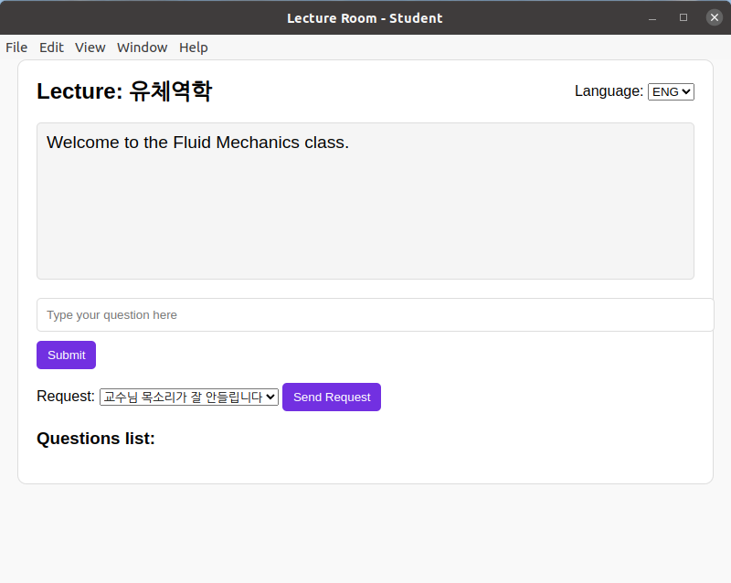
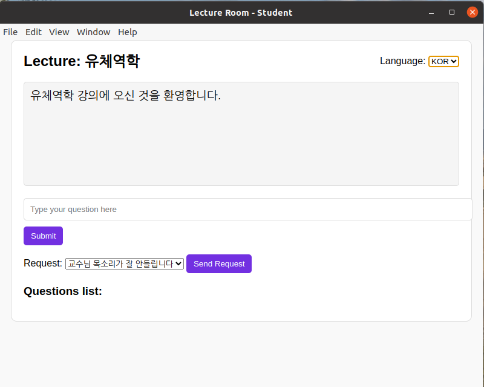
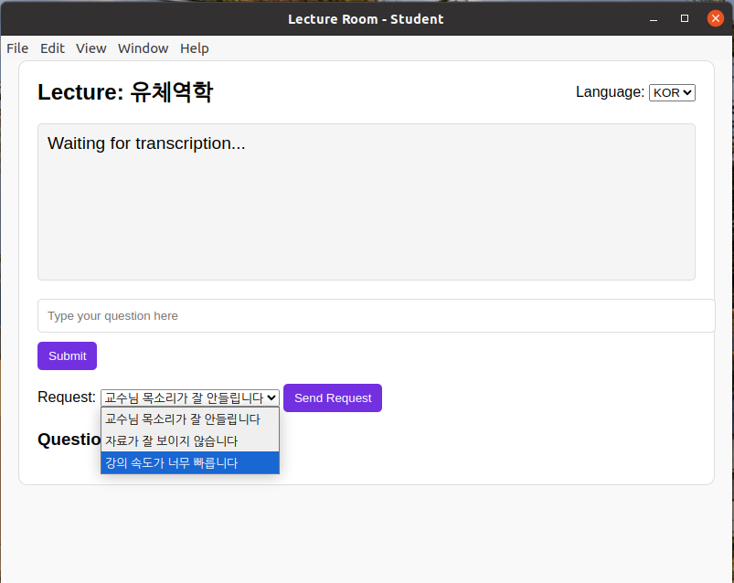
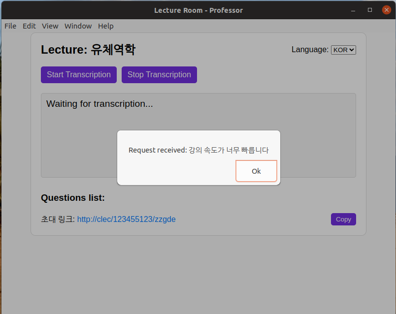
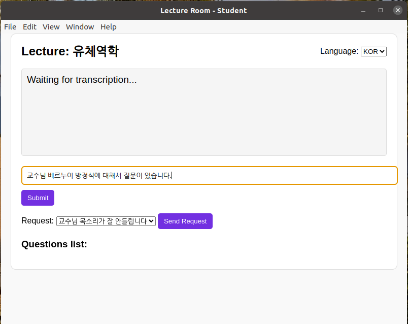
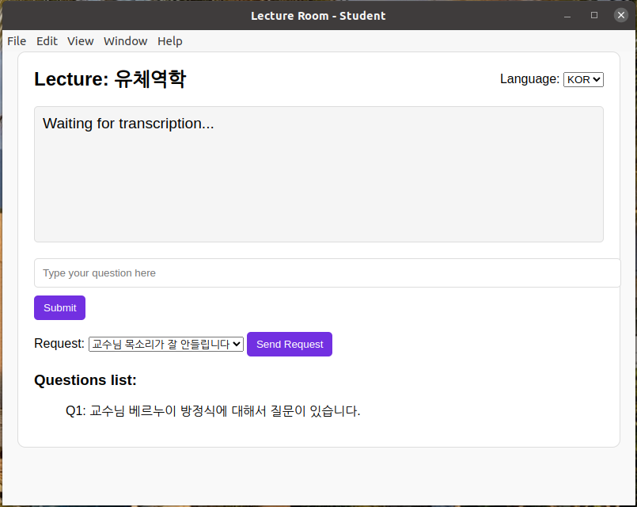

# COREA - Jang Yeongsil Invention and Startup Competition


## Overview
The **COREA - Jang Yeongsil Invention and Startup Competition** repository is dedicated to developing an interactive lecture support system. This project provides a real-time subtitle generation and display service for students, along with a question notification system for professors, enhancing the online learning experience.

## Key Features
- **Server Access with Random Code Generation**: Each student can securely access the lecture by generating a unique random code to join the session from their device.
- **Real-Time Subtitle Generation**: Transcribes the professor's live lecture audio into text on the professor's device and displays subtitles in real-time.
- **Subtitle Broadcasting**: Transmits the generated subtitles from the professor's client to each student's client, ensuring all students see real-time subtitles on their screens.
- **Student Question Submission**: Students can submit questions directly from their devices via the server's question tab, and professors are notified in real-time on their devices.

## Folder Structure

- `transcribe_lecture_to_text.py`: This Python script transcribes lecture audio to text in real-time.
- `my-electron-app`: This folder contains the Electron-based frontend application that serves as the user interface for students and professors.
- `result`: This folder contains PNG image files that demonstrate how the actual screens appear for each feature during use.

## Screenshots








## Requirements

- **Python**: Version 3.9.13
- **Electron**: Version 33.0.2
- **Node.js**: Ensure compatibility with Electron 33.0.2.

## Installation

Follow these steps to set up and run the project.

### Clone the Repository
Clone the repository from GitHub to your local machine:

```bash
git clone https://github.com/Highsky7/COREA-_Jang_Yeongsil_Invention_and_Startup_Competition.git
cd COREA-_Jang_Yeongsil_Invention_and_Startup_Competition
```

### Python Script Setup

#### Install Python Dependencies
Ensure that you have Python 3.9.13 installed.

#### Run the Python Script
To start the transcription service, run the Python script:

```bash
python transcribe_lecture_to_text.py
```

### Electron Application Setup

#### Install Node.js Dependencies
Navigate to the `my-electron-app` folder and install dependencies with npm:

```bash
cd my-electron-app
npm install
```

#### Run the Electron Application
Start the Electron application:

```bash
npm start
```

## Contributing

If you would like to contribute to this project, follow these steps:

1. **Create an Issue**: Discuss the planned changes by creating an issue.
2. **Implement Your Changes**: Make your changes in a separate branch.
3. **Submit a Pull Request**: Open a pull request to merge your branch into `master`.
4. **Code Quality**: Ensure code clarity and add comments where necessary to explain complex parts.

## License

This project is licensed under the [MIT License](LICENSE).
